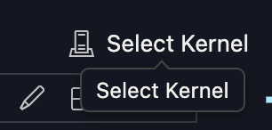
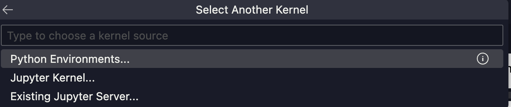
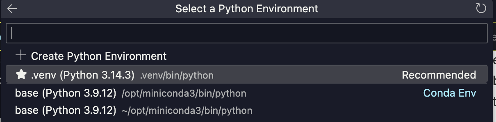

# Advanced Object Detection and Comparative Study using YOLOv11 / YOLOv26

**CMPE 401 — Instructor-defined Project 1**  
Design, Optimization, and Comparative Evaluation of Modern YOLO Models for Real-World Object Detection

---

## Project Overview

This project builds a complete object detection experimental pipeline using the **VisDrone2019-DET** dataset — a challenging benchmark featuring aerial drone footage with small, dense objects. The study covers:

- Baseline training with YOLO11/YOLO26
- Training dynamics and fitting analysis
- Structured controlled experiments
- Theory-driven iterative improvements
- Quantitative multi-version YOLO comparison

---

## Repository Structure

```
├── Data/                          # VisDrone dataset (not tracked by git)
│   ├── VisDrone2019-DET-train/
│   │   ├── images/
│   │   ├── annotations/           # Original VisDrone format
│   │   └── labels/                # YOLO format (after conversion)
│   ├── VisDrone2019-DET-val/
│   ├── VisDrone2019-DET-test-dev/
│   └── VisDrone2019-DET-test-challenge/
│
├── notebooks/
│   ├── 00_data_exploration.ipynb        # EDA + annotation conversion
│   ├── 01_baseline_training.ipynb       # Part I  — Baseline model
│   ├── 02_loss_analysis.ipynb           # Part II — Loss & fitting analysis
│   ├── 03_structured_experiments.ipynb  # Part III — Controlled experiments
│   ├── 04_iterative_improvement.ipynb   # Part IV — Iterative improvements
│   └── 05_multi_version_comparison.ipynb# Part V  — Multi-version comparison
│
├── scripts/
│   ├── convert_visdrone_to_yolo.py    # VisDrone → YOLO label conversion
│   ├── train.py                        # CLI training script
│   └── evaluate.py                     # CLI evaluation script
│
├── configs/
│   └── visdrone.yaml                   # Ultralytics dataset config
│
├── results/
│   ├── baseline/                       # Baseline training run outputs
│   ├── experiments/                    # Structured experiment runs
│   └── comparison/                     # Multi-version comparison outputs
│
├── models/                             # Saved best weights (not tracked by git)
├── requirements.txt
└── .gitignore
```

---

## Dataset: VisDrone2019-DET

The VisDrone dataset is a large-scale benchmark specifically designed for drone-view object detection.

| Split | Images | Notes |
|-------|--------|-------|
| Train | 6,471 | Annotated |
| Val | 548 | Annotated |
| Test-dev | 548 | Annotated (GT available) |
| Test-challenge | 1,610 | No GT (competition) |

**10 object classes**: pedestrian, people, bicycle, car, van, truck, tricycle, awning-tricycle, bus, motor

**Key challenges**:
- ~50-60% of objects are tiny (< 32×32 px)
- Dense scenes with 100-500+ objects per image
- Wide variety of weather, lighting, and altitude conditions

---

## Quick Start

### 1. Install Dependencies and create virtual environment

- From your root, create and activate the virtual environment:
```bash
python3.11 -m venv .venv && source .venv/bin/activate
```

- Install dependencies:
```bash
python3.11 -m pip install -r requirements.txt
```

- Reload the window:

    a. Open the Command Palette:
    - Windows / Linux: ```Ctrl + Shift + P```
    - macOS: ```Cmd + Shift + P```

    b. Type ```Developer:Reload Window```, and press enter
  

- Select the virtual environment as the notebook Kernel in VS Code:

   a. Click the kernel selector in the top right corner:

   

   b. Click **Python Environments**:

   

   c. Select the `.venv` environment that was just created:

   

---

### 2. Convert VisDrone Annotations to YOLO Format

```bash
python scripts/convert_visdrone_to_yolo.py --splits train val test-dev
```

This converts the VisDrone CSV annotation format to YOLO `class cx cy w h` format and writes `labels/` directories alongside the existing `images/` directories.

### 3. Run Notebooks

Open Jupyter and run in sequence:

```
notebooks/00_data_exploration.ipynb      <- Start here (also runs conversion)
notebooks/01_baseline_training.ipynb
notebooks/02_loss_analysis.ipynb
notebooks/03_structured_experiments.ipynb
notebooks/04_iterative_improvement.ipynb
notebooks/05_multi_version_comparison.ipynb
```


### 4. Evaluate a Trained Model

```bash
python scripts/evaluate.py --weights results/baseline/weights/best.pt --save_json
```

---

## Technical Tasks Completed

| Part | Task | Notebook |
|------|------|----------|
| I    | Baseline model training (YOLO11s on VisDrone) | 01 |
| II   | Training/validation loss analysis, overfitting/underfitting diagnosis | 02 |
| III  | Controlled experiments: resolution, model size, learning rate | 03 |
| IV   | Iterative improvements: weight decay, augmentation, combined | 04 |
| V    | Multi-version comparison: YOLOv5, v8, v9, v10, v11, v26 | 05 |

---

## Models Compared

| Model | Params | COCO mAP50-95 | Key Innovation |
|-------|--------|---------------|----------------|
| YOLOv5su | 7.2M | 43.0 | Anchor-based, widely adopted |
| YOLOv8s  | 11.2M | 44.9 | Anchor-free, decoupled head |
| YOLOv9c  | 25.3M | 53.0 | GELAN + Programmable Gradient Info |
| YOLOv10s | 7.2M  | 46.3 | NMS-free (one-to-one head) |
| YOLO11s  | 9.4M  | 47.0 | Improved backbone + neck, fewer params |
| YOLO26s  | 9.5M  | 48.6 | MuSGD, ProgLoss+STAL, NMS-free |

---

## Key Results

> Fill in after running the notebooks.

| Model | VisDrone mAP50 | VisDrone mAP50-95 | Inference (ms) | Train Time (min) |
|-------|---------------|------------------|----------------|-----------------|
| YOLOv5su | — | — | — | — |
| YOLOv8s | — | — | — | — |
| YOLOv9c | — | — | — | — |
| YOLOv10s | — | — | — | — |
| YOLO11s (baseline) | — | — | — | — |
| YOLO11s (improved) | — | — | — | — |
| YOLO26s | — | — | — | — |

---

## References

- Zhu, P. et al. (2021). *VisDrone-DET2019: The Vision Meets Drone Object Detection in Image Challenge Results.* ICCV Workshops.
- Jocher, G. & Qiu, J. (2024). *Ultralytics YOLO11.* v11.0.0. https://github.com/ultralytics/ultralytics
- Jocher, G. & Qiu, J. (2026). *Ultralytics YOLO26.* v26.0.0. https://github.com/ultralytics/ultralytics
- Wang, C.-Y. et al. (2024). *YOLOv9: Learning What You Want to Learn Using Programmable Gradient Information.* ECCV.
- Wang, A. et al. (2024). *YOLOv10: Real-Time End-to-End Object Detection.* NeurIPS.
