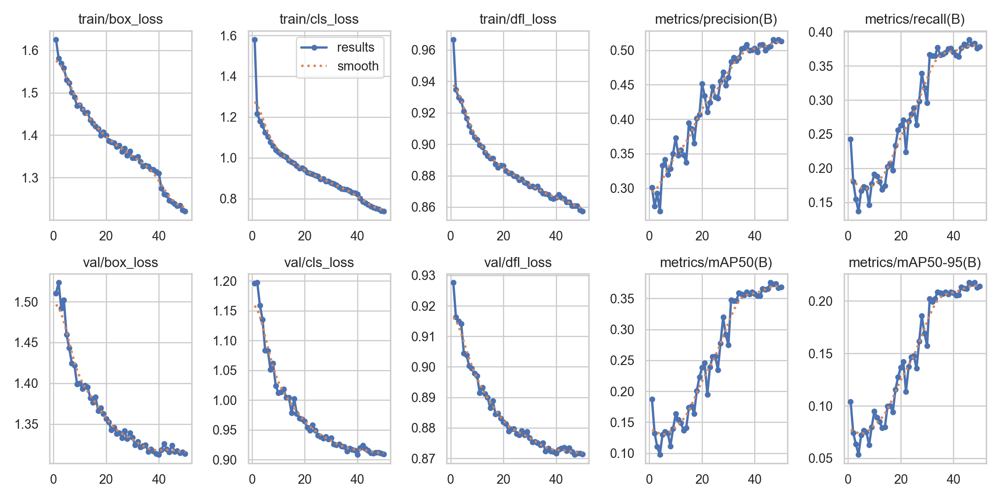
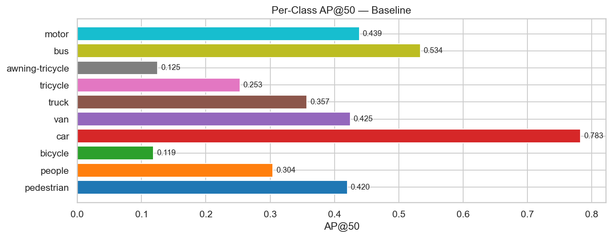
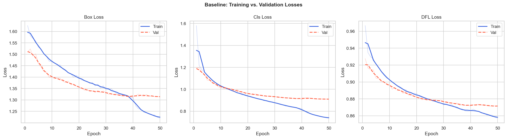
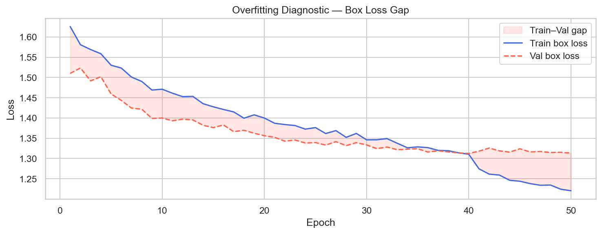
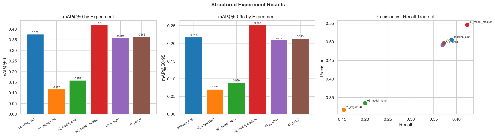
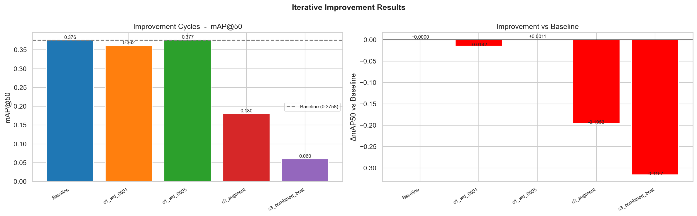
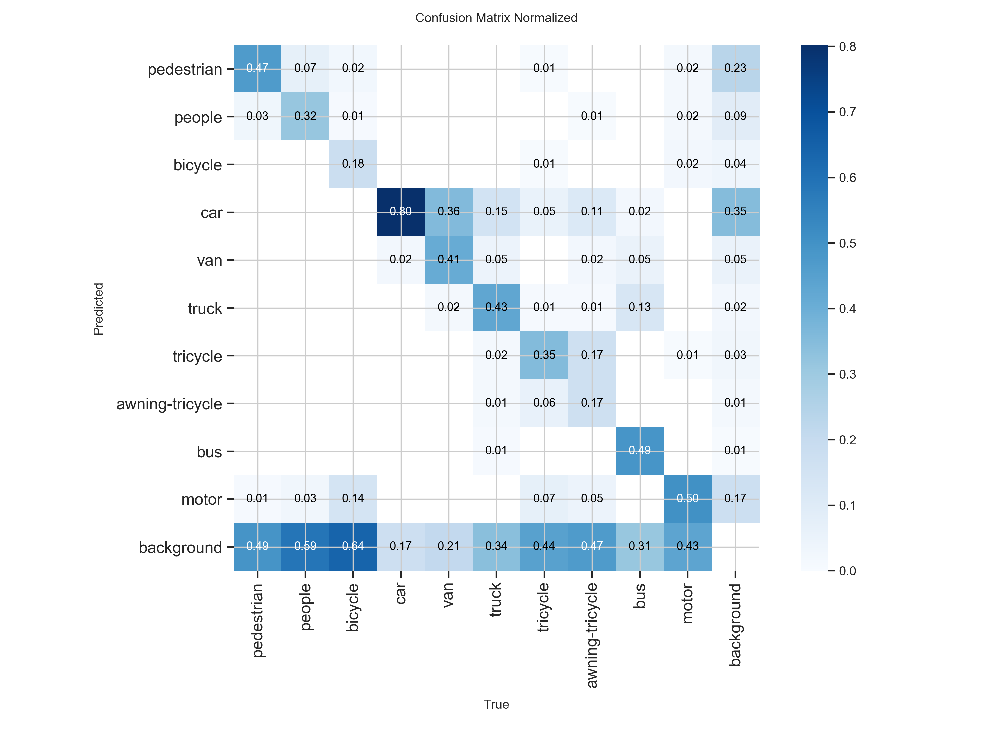
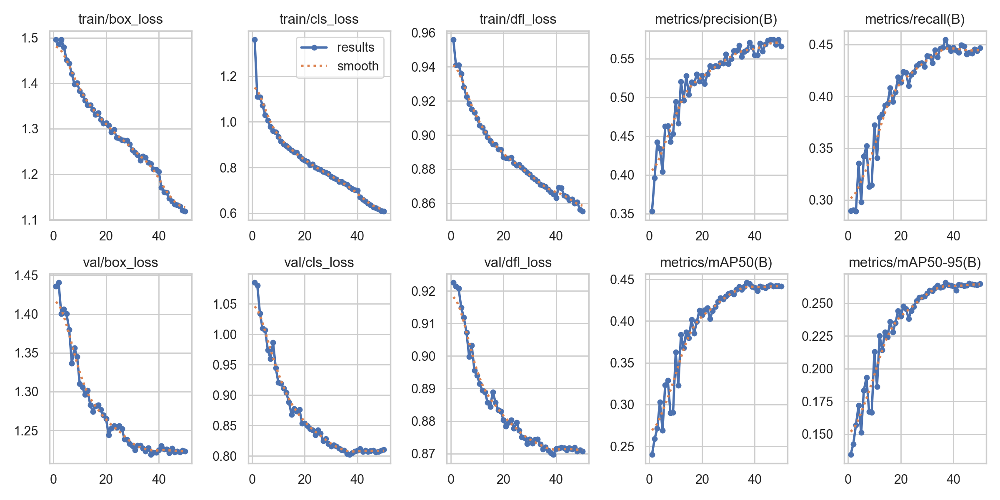

# Object Detection Study Using Modern YOLO Architectures on VisDrone

**CMPE 401 - Instructor-defined Project 1**
**Student:** Erem Ozdemir

---

## Reproducing Results

### Dataset Setup

Download the VisDrone 2019 Object Detection dataset from the [official VisDrone repository](https://github.com/VisDrone/VisDrone-Dataset). You need the following splits:

- `VisDrone2019-DET-train`
- `VisDrone2019-DET-val`
- `VisDrone2019-DET-test-dev`
- `VisDrone2019-DET-test-challenge` (for challenge predictions)

Place them under `Data/` at the project root so the structure matches `configs/visdrone.yaml`.

### Environment

```bash
python3.11 -m venv .venv && source .venv/bin/activate
pip install -r requirements.txt
```

In VS Code: open the Command Palette (`Cmd+Shift+P`), run `Developer: Reload Window`, then select the `.venv` kernel in the top-right of each notebook.

### Convert Annotations

VisDrone uses its own CSV annotation format. Convert to YOLO format before training:

```bash
python scripts/convert_visdrone_to_yolo.py --splits train val test-dev
```

### Run Notebooks

Open and run in order:

```
notebooks/00_data_exploration.ipynb         -- EDA and annotation conversion
notebooks/01_baseline_training.ipynb        -- Part I:   baseline model
notebooks/02_loss_analysis.ipynb            -- Part II:  loss curve analysis
notebooks/03_structured_experiments.ipynb   -- Part III: controlled experiments
notebooks/04_iterative_improvement.ipynb    -- Part IV:  improvement cycles
notebooks/05_multi_version_comparison.ipynb -- Part V:   multi-version comparison
```

Parts I-IV were trained locally on an Apple M4 Max (MPS). Part V was trained on an NVIDIA A100-SXM4-80GB via Google Colab to ensure all six models ran under identical hardware conditions.

---

## Goal

Train and evaluate YOLO models on VisDrone, a challenging aerial drone dataset with small, densely packed objects. The study covers baseline training, loss analysis, controlled ablations, iterative improvements, and a multi-version comparison across six YOLO generations (v5 through v26).

---

## Dataset

**VisDrone2019-DET** is collected by drone across 14 cities in China. All annotations are for object detection in still images (Task 1).

| Split | Images | Annotated Objects |
|-------|--------|-------------------|
| Train | 6,471 | ~195,000 |
| Val | 548 | 38,759 |
| Test-dev | 548 | 38,759 |
| Test-challenge | 1,580 | (no GT) |

**10 classes**: pedestrian, people, bicycle, car, van, truck, tricycle, awning-tricycle, bus, motor

Key challenges:
- ~50-60% of objects are smaller than 32x32 pixels at 640px input
- Up to 500 objects per image
- 14x class imbalance (car: 14,064 instances vs. bicycle: 1,287)
- Diverse lighting, altitude, and weather conditions

---

## Part I: Baseline Model

**Model**: YOLO11s (9.4M parameters, COCO pretrained, fine-tuned on VisDrone)
**Protocol**: 50 epochs, imgsz=640, batch=16, lr0=0.01, lrf=0.01, weight_decay=0.0005, patience=20
**Hardware**: Apple M4 Max (MPS)



| Metric | Value |
|--------|-------|
| mAP@50 | 0.3758 |
| mAP@50-95 | 0.2176 |
| Precision | 0.5058 |
| Recall | 0.3892 |
| Training time | ~5.5 hours |

**Per-class AP@50:**



| Class | AP@50 |
|-------|-------|
| car | 0.783 |
| bus | 0.534 |
| motor | 0.439 |
| van | 0.425 |
| pedestrian | 0.420 |
| truck | 0.357 |
| people | 0.304 |
| tricycle | 0.253 |
| awning-tricycle | 0.125 |
| bicycle | 0.119 |

Cars are detected most reliably because they are large and visually consistent from altitude. Bicycles and awning-tricycles are the hardest: they are rarely wider than 20px at 640px input and share visual features with motorcycles and tricycles. A mAP@50 of 0.376 is competitive for VisDrone at this scale; published small-model results typically fall between 0.35 and 0.45 on this benchmark.

---

## Part II: Loss and Fitting Analysis

Loss curves were extracted from the baseline training CSV and analyzed across all 50 epochs.



| Component | Train (final) | Val (final) | Val-Train Gap |
|-----------|--------------|-------------|---------------|
| Box loss | 1.2203 | 1.3133 | +0.0930 |
| Class loss | 0.7369 | 0.9089 | +0.1720 |
| DFL loss | 0.8572 | 0.8714 | +0.0142 |

**Diagnosis: Stable. Minimal overfitting.**



The val-train box loss gap was essentially flat over the final 20 epochs (slope near zero), indicating convergence rather than active divergence. The classification loss gap (0.172) is larger because the val set contains different scene distributions with more ambiguous class overlap between pedestrian/people and tricycle/motor.

The high absolute val loss values reflect the difficulty of VisDrone, not model failure. YOLO11s (9.4M params) is appropriately sized for 6,471 training images. A larger model like yolo11m would benefit from additional regularisation at this dataset scale to avoid overfitting.

**Dataset size factor**: 6,471 training images is modest for a 10-class dense detection task. State-of-the-art models typically expect datasets an order of magnitude larger.

**Model capacity factor**: YOLO11s has enough parameters to fit the training data without memorising it. The small val-train gap confirms this.

---

## Part III: Controlled Experiments

All experiments used YOLO11s as the base model with one variable changed at a time. To limit compute, each ran for 25 epochs instead of the baseline's 50. Results are conservative underestimates of what full training would produce.



| Experiment | Variable Changed | mAP@50 | vs Baseline |
|---|---|---|---|
| Baseline | imgsz=640, yolo11s, lr=0.01, 50 epochs | 0.3758 | -- |
| E1 | imgsz=1280, batch=8 | 0.1170 | -68.9% |
| E2a | yolo11n (3.2M params) | 0.1588 | -57.7% |
| E2b | yolo11m (20.1M params) | 0.4197 | +11.7% |
| E3a | lr0=0.001 | 0.3601 | -4.2% |
| E3b | cos_lr=True | 0.3652 | -2.8% |

**E1 (Resolution):** The 1280px run collapsed to 0.117. This is not a finding against higher resolution; it is a confound from the fixed epoch budget. The warmup schedule, LR decay, and batch size are all calibrated for 640px. At 1280px, the model needs more epochs to converge. Resolution is a genuine lever for VisDrone's small-object problem, but 25 epochs at double resolution is not enough to see it.

**E2 (Model size):** The clearest finding. The nano model (3.2M params) is under-capacitated for 10-class dense detection (-57.7%). The medium model gains +11.7% by providing more representational capacity for VisDrone's complex multi-scale scenes. Capacity is the most reliable lever at this input size.

**E3 (Learning rate):** No meaningful difference at either setting. AdamW's adaptive per-parameter learning rates already compensate for schedule choices over 25-50 epoch runs.

---

## Part IV: Iterative Improvement

Three improvement cycles were applied to YOLO11s for 50 epochs each on Apple M4 Max.



| Cycle | Config | mAP@50 | mAP@50-95 | vs Baseline |
|-------|--------|--------|-----------|-------------|
| Baseline | wd=0.0005 | 0.3758 | 0.2176 | -- |
| C1a | wd=0.001 (moderate L2) | 0.3616 | 0.2121 | -3.8% |
| C1b | wd=0.005 (strong L2) | 0.3769 | 0.2206 | +0.3% |
| C2 | augment=True (mosaic+mixup+flipud) | 0.1805 | 0.1049 | -52.0% |
| C3 | wd=0.001 + aug + cos_lr + imgsz=1280 | 0.0601 | 0.0362 | -84.0% |

**C1 (Weight decay):** Both L2 variants had negligible effect. YOLO11s is not meaningfully overfitting the 6,471-image training set, so adding regularisation does not address the actual bottleneck.

**C2 (Augmentation):** Enabling `augment=True` in the Ultralytics `train()` call triggers test-time augmentation during training inference, not just additional data augmentation. This is a known API behaviour in Ultralytics 8.x. The resulting gradient instability caused a 52% mAP collapse. The model failed to converge because TTA multiplies per-step inference cost and destabilises the gradient signal.

**C3 (Combined):** Each individual change was already neutral or harmful in isolation. At 1280px with a broken augmentation pipeline, the model produced the worst result of the entire study (mAP@50=0.060).

**Conclusion**: The most reliable improvement across all experiments was model capacity (yolo11m from Part III, +11.7%). Default YOLO11s hyperparameters are already well-calibrated for this dataset.

---

## Part V: Multi-Version YOLO Comparison

All six models were trained for 50 epochs at imgsz=640, batch=16, identical hyperparameters, on an NVIDIA A100-SXM4-80GB (Google Colab). Inference speed was measured on the same A100.

| Rank | Model | mAP@50 | mAP@50-95 | Precision | Recall | Params (M) | Inference (ms) | Train (min) |
|------|-------|--------|-----------|-----------|--------|-----------|---------------|-------------|
| 1 | **YOLOv9c** | **0.4454** | **0.2653** | **0.5688** | **0.4461** | 25.6 | 5.08 | 122.8 |
| 2 | YOLOv8s | 0.3797 | 0.2202 | 0.5114 | 0.3927 | 11.2 | 0.80 | 39.8 |
| 3 | YOLOv10s | 0.3789 | 0.2196 | 0.5136 | 0.3868 | 8.1 | 2.40 | 59.4 |
| 4 | YOLO11s | 0.3783 | 0.2217 | 0.5156 | 0.3873 | 9.5 | 2.65 | 46.4 |
| 5 | YOLO26s | 0.3749 | 0.2173 | 0.5012 | 0.3892 | 10.0 | 3.02 | 62.2 |
| 6 | YOLOv5s | 0.3643 | 0.2095 | 0.5052 | 0.3743 | 9.2 | 1.13 | 64.9 |

**YOLOv9c leads by a clear margin.** At 0.4454 mAP@50, it is 6.5% ahead of the next-best model. Two architectural factors explain this on VisDrone specifically:

1. **GELAN (Generalised Efficient Layer Aggregation Network)** builds a richer multi-scale feature hierarchy than the CSPNet (v5) or C2f (v8/v10/v11) backbones. This matters for detecting objects spanning a wide size range in a single image.

2. **Programmable Gradient Information (PGI)** forces the network to maintain complete gradient signals throughout training. In standard deep networks, tiny objects contribute negligible gradient to early layers. PGI corrects this, which directly targets VisDrone's core difficulty: over half of all objects are below 32x32 pixels.

**v8, v10, v11, and v26 are statistically indistinguishable** at this parameter scale. Their mAP@50 values span 0.3749-0.3797, a 1.3% range across four architectures with meaningfully different design choices (anchor-free heads, NMS-free matching, MuSGD). At 8-11M parameters and 640px input, the ceiling is set by resolution, not by architecture.

**YOLOv5s holds its own** at 0.3643, only 2% below the newer models. For VisDrone at 640px, five generations of architectural improvements provide marginal gains at the small-model tier.

### Confusion Matrix: YOLOv9c (Best Model)



The confusion matrix shows the hardest class boundaries for YOLOv9c:
- **pedestrian/people**: These two classes are semantically similar (individual vs. grouped pedestrians) and frequently misclassified between each other.
- **tricycle/motor**: Visual overlap between three-wheeled vehicles at altitude.
- **background FP**: Some false positives in cluttered scenes, particularly at image edges where objects are truncated.

### YOLOv9c Training Curves



### Speed vs. Accuracy Trade-offs

| Use Case | Model | Rationale |
|----------|-------|-----------|
| Maximum accuracy | YOLOv9c | +18.5% over YOLO11s baseline, GELAN+PGI architecture |
| Real-time throughput | YOLOv8s | 0.80ms/img, 6.4x faster than YOLOv9c, only -6.5% mAP |
| Edge/memory-constrained | YOLOv10s | 8.1M params, NMS-free head, competitive mAP |
| General production | YOLO11s | Best precision (0.5156), mature ecosystem, well-documented |

### Challenge Test-Set Predictions

The YOLOv9c model (val mAP@50=0.4454) was run on the VisDrone test-challenge set (1,580 images, no ground truth). Predictions are saved in official VisDrone submission format at `results/challenge_predictions/visdrone_format/`.

Inference settings: conf=0.25, IoU=0.45, imgsz=640.

---

## References

- Zhu, P. et al. (2021). *VisDrone-DET2019: The Vision Meets Drone Object Detection in Image Challenge Results.* ICCV Workshops.
- Jocher, G. & Qiu, J. (2024). *Ultralytics YOLO11.* https://github.com/ultralytics/ultralytics
- Jocher, G. & Qiu, J. (2026). *Ultralytics YOLO26.* https://github.com/ultralytics/ultralytics
- Wang, C.-Y. et al. (2024). *YOLOv9: Learning What You Want to Learn Using Programmable Gradient Information.* ECCV 2024.
- Wang, A. et al. (2024). *YOLOv10: Real-Time End-to-End Object Detection.* NeurIPS 2024.
- Jocher, G. (2020). *YOLOv5.* https://github.com/ultralytics/yolov5
- Jocher, G. et al. (2023). *YOLOv8: Ultralytics YOLO.* https://github.com/ultralytics/ultralytics
